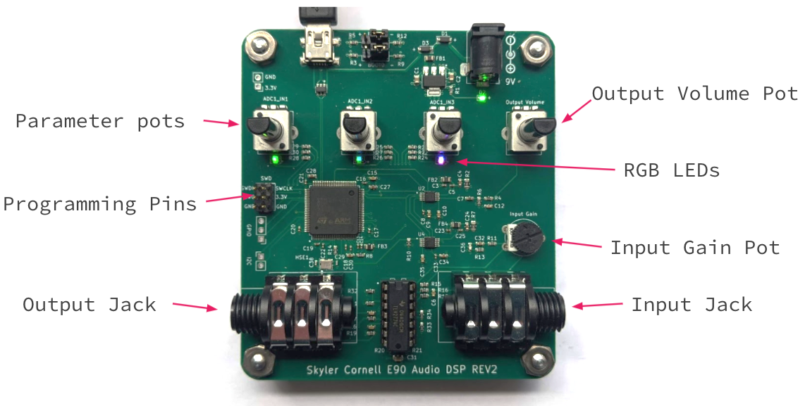

# E90: Low Cost Embedded DSP Development Platform

The platform is designed for the development of DSP algorithms and provides the hardware and software infrastructure to get started writing programs manipulating real time audio signals in the C programming language. The board manages the analog audio input and output circuits, microcontroller peripherals, and the data flow, allowing a programmer to focus their efforts on designing DSP. The board was also designed wih musicians in mind, and can act as a programmable real time effects unit that players can plug their instruments into and run pre-compiled effects. An eventual goal of the project is to curate a growing library of pre-compiled firmware written by a community of developers that anyone can download and easily upload to the board to try out with their instruments. 

The board supports stereo 24bit audio at 48kHz sampling and implements a highly optimized DMA audio stream scheme.

